# 🎓 Pratiyogita Setu — Complete Career Preparation Ecosystem

<div align="center">

*Your one-stop solution for competitive exam preparation — from checking eligibility to mastering the syllabus*


</div>

---

## Overview

"STARTING_AGE", means 19, 21, 23 is the startinga age
"ENDING_AGE", means 30, 38, 42 are the ending age
"BETWEEN_AGE",means 16 to 19, 21 to 25 are the between age 
"MINIMUM_DOB", means born on or before 31-12-2009         
"MAXIMUM_DOB", born on or after 31-12-2009 
"BETWEEN_DOB", "02-01-2003 to 01-01-2008", range for candidates appearing in exam
"NO_AGE_LIMIT" means no age limit 


Preparing for competitive exams in India shouldn't be complicated. You need to know which exams you're eligible for, understand what to study, and then actually study it effectively. That's exactly what this platform does — it guides you through the entire journey.

We've built four integrated applications that work together:

**🌐 Pratiyogita Setu** — The central landing portal. A beautifully animated website that introduces the ecosystem and connects students to all three specialized apps. Features Gyan Posters, an interactive India map, and theme switching.

**🔍 Pratiyogita Yogya** — Check your eligibility for hundreds of competitive exams across UPSC, SSC, Banking, Railway, Defense, and more. Just enter your details and instantly see every exam you qualify for.

**🗺️ Pratiyogita Marg** — Create, save, and share detailed mind maps for exam preparation. A full-featured mind map maker tool with 10+ node types, visual styling, auto-save, Firebase sync, and a read-only view mode for sharing.

**📚 Pratiyogita Gyan** — Study smart with an AI-powered assistant. Get instant answers from NCERT textbooks with source citations, practice thousands of previous year questions, take quizzes, and track your preparation progress.

### How It Works

1. **Discover** → Visit Pratiyogita Setu to explore the ecosystem
2. **Check Eligibility** → Use Pratiyogita Yogya to find all exams you're eligible for
3. **Plan Your Prep** → Use Pratiyogita Marg to create mind maps and visual study plans
4. **Start Studying** → Use Pratiyogita Gyan to learn with AI assistance, practice PYQs, and track progress

---

## Technology Stack

| Application | Technologies |
|---|---|
| **Pratiyogita Setu** | React 18, Vite 6, Tailwind CSS 4, Framer Motion, GSAP, React Spring, AOS |
| **Pratiyogita Yogya** | React 19, Vite 6, Tailwind CSS 4, Firebase 11, HeroUI, MUI 6, html2canvas, jsPDF |
| **Pratiyogita Marg** | React 18, **TypeScript**, Vite 5, Tailwind CSS 3, shadcn/ui, **@xyflow/react 12** (mind maps), Firebase 12 |
| **Pratiyogita Gyan** | React 18, Vite 6, Tailwind CSS 3, MUI 7, Firebase, Lucide Icons, react-markdown |
| **Backend API** | Flask 3, Python 3.11+, Gunicorn |

**Shared Infrastructure:**
- **AI & ML**: OpenAI (GPT-4o-mini), Groq (Llama 3.1), HuggingFace Embeddings
- **Vector Database**: Pinecone (RAG retrieval for NCERT content & PYQs)
- **Authentication**: Firebase Auth (Email, Google, GitHub) — shared across Yogya, Marg, Gyan
- **Database**: Firebase Firestore (user data, mind maps, exam data)
- **Hosting**: Vercel (all frontends), Railway/Render (Flask backend)
- **PWA**: Service Workers + Offline Support (Gyan)

---

## Project Structure

```
pratiyogita-setu/
│
├── pratiyogita_setu/              # 🌐 Landing Portal (React 18, JS)
│   ├── src/
│   │   ├── Components/            # Navbar, Footer, Home sections, UI
│   │   ├── Pages/                 # HomePage, AboutUs, GyanPosters
│   │   └── context/               # ThemeContext (dark/light)
│   ├── public/                    # Logos, social media icons, images
│   └── vercel.json
│
├── pratiyogita_yogya/             # 🔍 Eligibility Checker (React 19, JS)
│   ├── src/
│   │   ├── Pages/                 # CheckEligibility, Login, Signup, About, Contact
│   │   ├── components/            # Navbar, Footer, AuthModal, UI
│   │   ├── eligibility/           # Core eligibility engine
│   │   │   ├── eligibilityChecker.js
│   │   │   └── checker/           # 15 modular criteria checkers
│   │   ├── contexts/              # AuthContext
│   │   └── config/                # Firebase config
│   ├── public/
│   │   ├── examsdata/             # Exam eligibility JSON data
│   │   │   ├── BANKING_EXAMS/     # 14 exam category folders
│   │   │   ├── CIVIL_SERVICES_EXAMS/
│   │   │   ├── DEFENCE_EXAMS/
│   │   │   └── ...
│   ├── scripts/                   # Firestore data upload scripts
│   └── vercel.json
│
├── pratiyogita_marg/              # 🗺️ Mind Map Maker (React 18, TypeScript)
│   ├── src/
│   │   ├── pages/                 # MindMapEditor, MindMapViewer, ExamCatalog, Auth
│   │   ├── components/
│   │   │   ├── mindmap/           # ⭐ Full mind map system
│   │   │   │   ├── MindMap.tsx            # Core editor canvas
│   │   │   │   ├── BaseNode.tsx           # Title/Topic/Subtopic/Paragraph nodes
│   │   │   │   ├── WorkspaceBoundary.tsx  # 800×3000 workspace area
│   │   │   │   ├── MindMapHeader.tsx      # Map title/description header
│   │   │   │   ├── MindMapNodeManager.ts  # Node creation & management
│   │   │   │   ├── ExportedMindMap.tsx    # View-mode renderer
│   │   │   │   ├── node-components/       # 10 node types (Circle, Square, Triangle, etc.)
│   │   │   │   ├── settings/              # Node & edge visual settings
│   │   │   │   └── utils/                 # Font sizing, export, helpers
│   │   │   ├── Navbar.tsx, Footer.tsx
│   │   │   └── ui/                # shadcn/ui components
│   │   ├── utils/                 # mindmapStorage.ts, mindmapRenderer.ts
│   │   ├── contexts/              # AuthContext
│   │   └── config/                # Firebase config
│   └── vercel.json
│
├── pratiyogita_gyan/              # 📚 AI Study Assistant (React 18, JS)
│   ├── src/
│   │   ├── components/            # ChatSection, Dashboard, PYQ, Quiz, Sidebar, Auth
│   │   ├── contexts/              # Auth, Dashboard, Layout, SearchHistory, Theme
│   │   ├── config/                # Firebase config
│   │   ├── services/              # Backend API calls
│   │   └── utils/                 # Helpers
│   ├── backend/                   # Flask API
│   │   ├── app.py                 # RAG pipeline, PYQ retrieval, chat endpoints
│   │   ├── train_pyq.py           # PYQ data indexing script
│   │   ├── requirements.txt       # Python dependencies
│   │   └── Procfile               # gunicorn deployment
│   ├── public/                    # PWA assets, offline.html, sw.js
│   └── vercel.json
│
├── SCREENSHOTS/                   # Application screenshots
├── README.md                      # This file
└── runtime.txt                    # Python 3.11.9
```

---

## Getting Started

### Prerequisites

- **Node.js 18+** — [nodejs.org](https://nodejs.org)
- **Python 3.11+** — [python.org](https://python.org) (only for Pratiyogita Gyan backend)
- **Git** — For cloning the repository
- **Firebase Project** — [firebase.google.com](https://firebase.google.com) (required for Yogya, Marg, Gyan)
- **API Keys** (for Pratiyogita Gyan backend only):
  - [OpenAI](https://platform.openai.com/api-keys) or [Groq](https://console.groq.com/keys) — LLM
  - [Pinecone](https://pinecone.io) — Vector database

### 1. Clone the Repository

```bash
git clone https://github.com/pratiyogitasetu/chatbot.git
cd chatbot
```

### 2. Set Up Pratiyogita Setu (Landing Portal)

No environment variables needed — this is a static frontend.

```bash
cd pratiyogita_setu
npm install
npm run dev
# Opens on http://localhost:5173
```

### 3. Set Up Pratiyogita Yogya (Eligibility Checker)

```bash
cd pratiyogita_yogya
cp .env.example .env
# Edit .env with your Firebase credentials
npm install
npm run dev
# Opens on http://localhost:5173 (or next available port)
```

**Required `.env` variables:**
```env
VITE_FIREBASE_API_KEY=your_api_key
VITE_FIREBASE_AUTH_DOMAIN=your-project.firebaseapp.com
VITE_FIREBASE_PROJECT_ID=your-project-id
VITE_FIREBASE_STORAGE_BUCKET=your-project.appspot.com
VITE_FIREBASE_MESSAGING_SENDER_ID=your_sender_id
VITE_FIREBASE_APP_ID=your_app_id
VITE_FIREBASE_MEASUREMENT_ID=your_measurement_id
VITE_FIREBASE_APPCHECK_SITE_KEY=your_recaptcha_v3_site_key

# Firestore collection config
VITE_EXAM_CATALOG_COLLECTION=examCatalog
VITE_EXAM_CATALOG_DOC_ID=allExamNames
VITE_EXAM_DATA_COLLECTION=examData

# Cross-app links (optional)
VITE_PRATIYOGITA_GYAN_URL=https://your-gyan-url.vercel.app
VITE_PRATIYOGITA_MARG_URL=https://your-marg-url.vercel.app
```

**Seed exam data to Firestore (first-time setup):**
```bash
npm run seed:exam-data
```

### 4. Set Up Pratiyogita Marg (Mind Map Maker)

```bash
cd pratiyogita_marg
cp .env.example .env
# Edit .env with your Firebase credentials
npm install
npm run dev
# Opens on http://localhost:8080
```

**Required `.env` variables:**
```env
VITE_FIREBASE_API_KEY=your_api_key
VITE_FIREBASE_AUTH_DOMAIN=your-project.firebaseapp.com
VITE_FIREBASE_PROJECT_ID=your-project-id
VITE_FIREBASE_STORAGE_BUCKET=your-project.appspot.com
VITE_FIREBASE_MESSAGING_SENDER_ID=your_sender_id
VITE_FIREBASE_APP_ID=your_app_id
VITE_FIREBASE_MEASUREMENT_ID=your_measurement_id

# Cross-app links (optional)
VITE_PRATIYOGITA_YOGYA_URL=https://your-yogya-url.vercel.app
VITE_PRATIYOGITA_GYAN_URL=https://your-gyan-url.vercel.app
```

### 5. Set Up Pratiyogita Gyan (AI Study Assistant)

This app has **two parts** — a React frontend and a Flask backend.

#### Backend (Flask API)

```bash
cd pratiyogita_gyan/backend

# Create virtual environment
python -m venv venv
# Windows:
venv\Scripts\activate
# macOS/Linux:
source venv/bin/activate

# Install dependencies
pip install -r requirements.txt

# Configure environment
cp .env.example .env
# Edit .env with your API keys
```

**Required backend `.env` variables:**
```env
PINECONE_API_KEY=your_pinecone_api_key
OPENAI_API_KEY=your_openai_api_key
GROQ_API_KEY=your_groq_api_key
OPENAI_MODEL_NAME=gpt-4o-mini
GROQ_MODEL_NAME=llama-3.1-8b-instant
ALLOWED_ORIGINS=http://localhost:3002
```

```bash
# Start the backend
python app.py
# Runs on http://localhost:5000
```

#### Frontend (React)

```bash
cd pratiyogita_gyan
cp .env.example .env
# Edit .env with your Firebase credentials and backend URL
npm install
npm run dev
# Opens on http://localhost:3002
```

**Required frontend `.env` variables:**
```env
VITE_API_BASE_URL=http://localhost:5000
VITE_FIREBASE_API_KEY=your_api_key
VITE_FIREBASE_AUTH_DOMAIN=your-project.firebaseapp.com
VITE_FIREBASE_PROJECT_ID=your-project-id
VITE_FIREBASE_STORAGE_BUCKET=your-project.appspot.com
VITE_FIREBASE_MESSAGING_SENDER_ID=your_sender_id
VITE_FIREBASE_APP_ID=your_app_id

# Cross-app links (optional)
VITE_PRATIYOGITA_YOGYA_URL=https://your-yogya-url.vercel.app
VITE_PRATIYOGITA_MARG_URL=https://your-marg-url.vercel.app
```

### Quick Start Summary

| App | Directory | Command | Port |
|-----|-----------|---------|------|
| Setu (Portal) | `pratiyogita_setu/` | `npm run dev` | 5173 |
| Yogya (Eligibility) | `pratiyogita_yogya/` | `npm run dev` | 5173+ |
| Marg (Mind Maps) | `pratiyogita_marg/` | `npm run dev` | 8080 |
| Gyan Backend | `pratiyogita_gyan/backend/` | `python app.py` | 5000 |
| Gyan Frontend | `pratiyogita_gyan/` | `npm run dev` | 3002 |

> **Note:** All four frontends can run simultaneously. Setu and Yogya will auto-pick different ports if 5173 is taken.

---

## Features in Detail

### 🌐 Pratiyogita Setu — Landing Portal

The central gateway to the entire ecosystem.

- **Animated Landing Page** — Framer Motion, GSAP, and AOS-powered animations
- **Interactive India Map** — Highlights exam conducting regions
- **Infinity Image Scrolls** — Seamless horizontal scrolling showcasing exam logos
- **Gyan Posters** — Visual study aid posters with subject filtering, lightbox view, like/dislike, and download
- **Dark/Light Theme** — Toggle via ThemeContext, with a grainy animated background in dark mode
- **Responsive Navbar** — Mobile hamburger menu with smooth transitions
- **Standardized Footer** — 2-column layout (Our Services | About Us) consistent across all apps

**Routes:** `/` (Home), `/about`, `/gyan-posters`, `/contact` (coming soon)

---

### 🔍 Pratiyogita Yogya — Eligibility Checker

Check eligibility for hundreds of competitive exams instantly.

- **15 Modular Criteria Checkers** — Age, education level, caste/category, gender, nationality, domicile, PWD status, NCC certification, marital status, mandatory subjects, active backlogs, and more
- **14 Exam Categories** — Banking, Civil Services, Defence, Engineering, Insurance, MBA, Nursing, PG, Police, Railway, School, SSC, Teaching, UG
- **Division-Based & Non-Division Criteria** — Handles both percentage-based and pass/fail eligibility
- **PDF Export** — Save eligibility results using html2canvas + jsPDF
- **Firebase Auth** — Login/Signup with email
- **Exam Data Seeding** — Upload exam data to Firestore via `npm run seed:exam-data`

**Routes:** `/` → `/check-eligibility`, `/about`, `/contact`, `/login`, `/signup`, `/terms-and-conditions`, `/refund-policy`

---

### 🗺️ Pratiyogita Marg — Mind Map Maker

A full-featured mind map creation tool built with @xyflow/react.

**Editor Features:**
- **10+ Node Types** — Title, Topic, Subtopic, Paragraph, Section, Circle, Square, Rectangle, Triangle, Note, Concept, Checklist, Resource
- **Rich Node Styling** — Background color, stroke color/width/style, font size, text alignment, opacity, rotation, shadow, glow effects
- **Edge Customization** — Stroke color, width, style (solid/dashed/dotted), arrow markers
- **Resizable Nodes** — All node types support drag-to-resize with optional aspect ratio lock
- **Workspace Boundary** — 800×3000px orange dotted area defining the map canvas
- **Components Sidebar** — Drag-and-drop basic and advanced node types
- **Context Menus** — Right-click nodes for quick actions (delete, duplicate, etc.)
- **Auto-Save** — Configurable auto-save intervals
- **Dual Storage** — Saves to localStorage (primary) + mirrors to Firebase Firestore per user
- **Firebase Sync** — On login, syncs all mind maps from Firestore → localStorage
- **Map Header** — Title, description, and sub-details with edit/read-only modes
- **MiniMap + Controls** — Navigate large maps with the built-in mini map

**View Mode:**
- **Scroll-Only Viewing** — No pan/zoom; the mindmap renders in a fixed-width (800px) container with native vertical scrolling
- **Content-Aware Height** — Dynamically calculates height from node positions (no wasted empty space)
- **Responsive Scaling** — On smaller screens, the map scales down to fit screen width
- **Clean Presentation** — No handles, resize controls, settings buttons, or workspace boundary visible
- **Sticky Header** — Map title/description stays visible while scrolling
- **Node Click Details** — Click any node to see its full content in a dialog

**Routes:** `/explore` (exam catalog), `/editor` (auth-required), `/view` (public), `/login`, `/signup`, `/about`

---

### 📚 Pratiyogita Gyan — AI Study Assistant

AI-powered study platform with RAG (Retrieval-Augmented Generation).

**AI Chat:**
- **NCERT RAG Pipeline** — Questions are vectorized, matched against Pinecone-indexed NCERT content, then answered by GPT-4o-mini with source citations
- **Dual LLM Fallback** — OpenAI primary, Groq (Llama 3.1) secondary if OpenAI fails/times out
- **Source Citations** — Every answer includes the NCERT chapter/page it came from
- **Contextual PYQ Integration** — Related previous year questions appear alongside AI answers
- **Chat History** — Full conversation persistence via Firebase

**PYQ Practice:**
- Thousands of questions from UPSC, SSC, Banking, Railway exams
- Detailed explanations for every answer
- Filter by exam type, subject, year
- Track attempted questions

**Quiz Mode:**
- Choose subjects and set time limits
- Instant scoring with detailed explanations
- Accuracy tracking over time

**Dashboard:**
- Total study time (overall and per subject)
- Questions attempted and accuracy rate
- Subject-wise performance breakdown
- Study streak and consistency tracking

**Other Features:**
- **Eligibility Section** — Embedded eligibility checking within the app
- **Syllabus Viewer** — Browse exam syllabi inline
- **GD Topics** — Group Discussion topic bank
- **PWA** — Install as a native app with offline support
- **Dark/Light Theme** — System or manual toggle
- **Multi-Auth** — Email, Google, GitHub sign-in

**Navigation:** State-based (no URL routing) — Chat, Dashboard, PYQ Practice, Quiz, Eligibility, Syllabus, GD Topics

---

## Screenshots

### Pratiyogita Yogya — Eligibility Checker

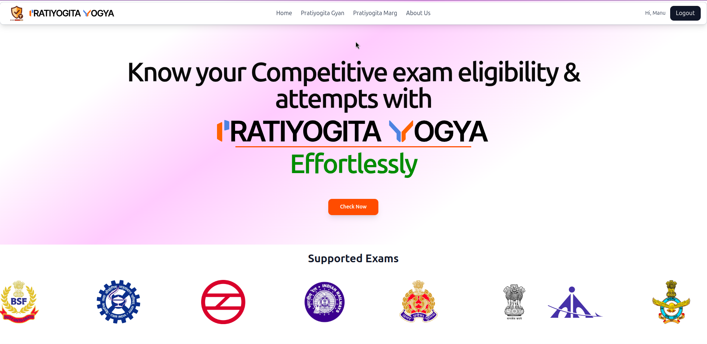
**Eligibility Checker** — Enter qualifications, age, and category to see all eligible exams.

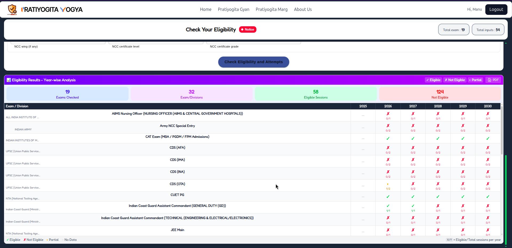
**Results** — Comprehensive list of eligible exams with matched criteria.

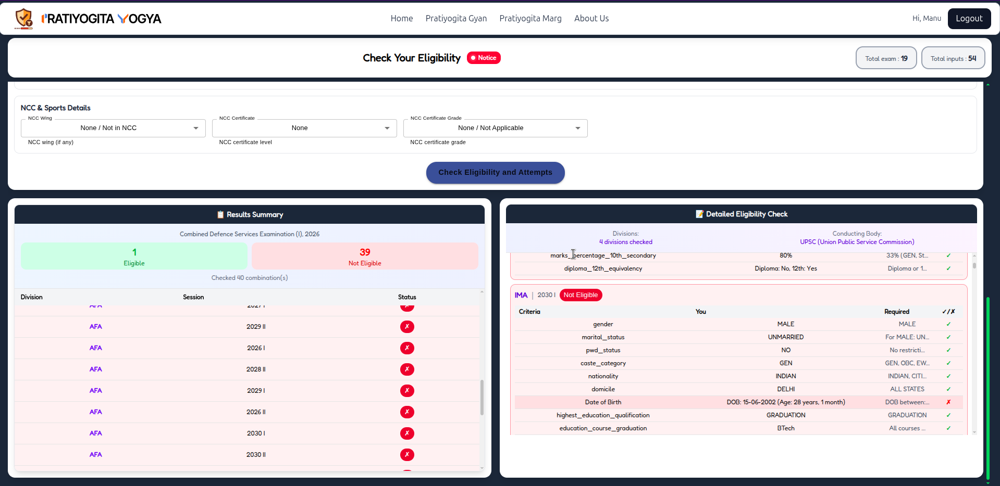
**Exam Details** — Full details including pattern, syllabus, dates, and application links.

---

### Pratiyogita Marg — Mind Map Maker

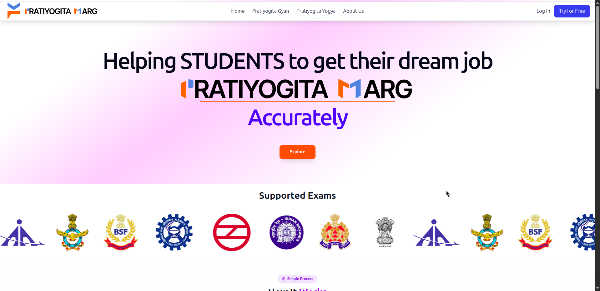
**Explore Page** — Browse available mind maps with a dark grainy theme.

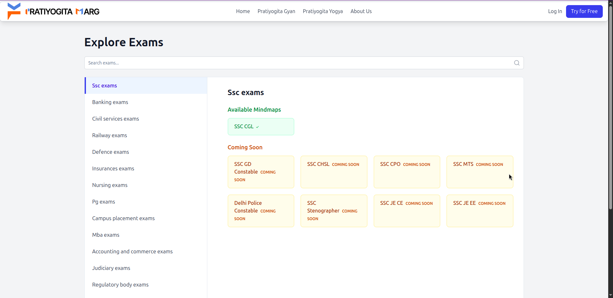
**Exam Categories** — Organized by exam type for easy discovery.

---

### Pratiyogita Gyan — AI Study Assistant

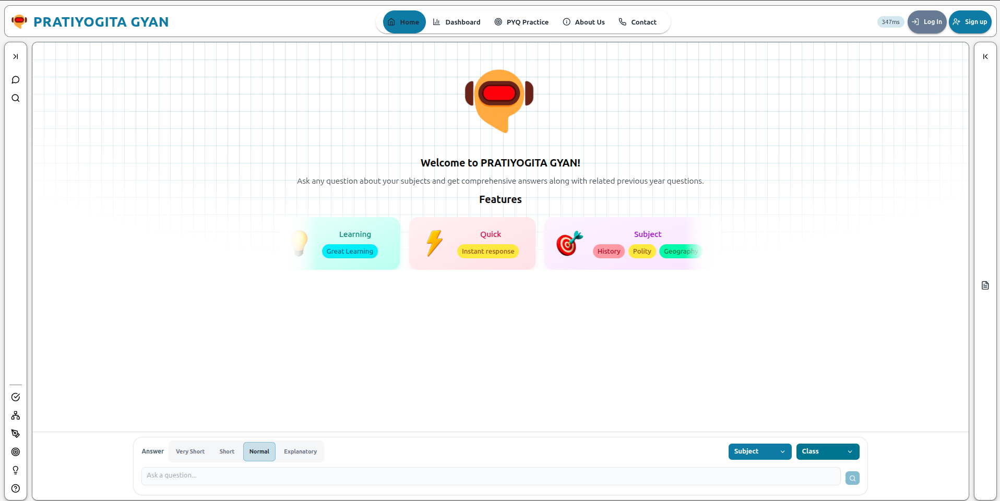
**AI Chat Interface** — Ask any question and get NCERT-backed answers with source citations.

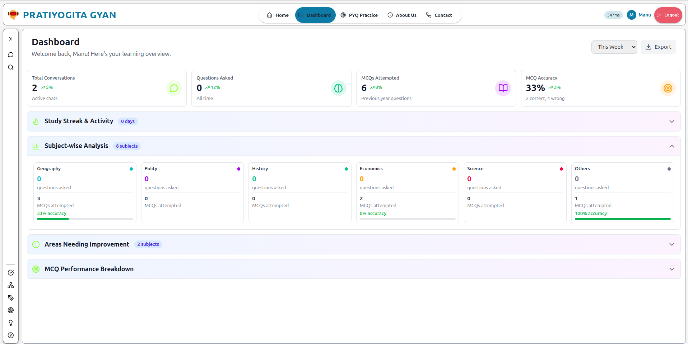
**Performance Dashboard** — Track study time, accuracy, and progress by subject.

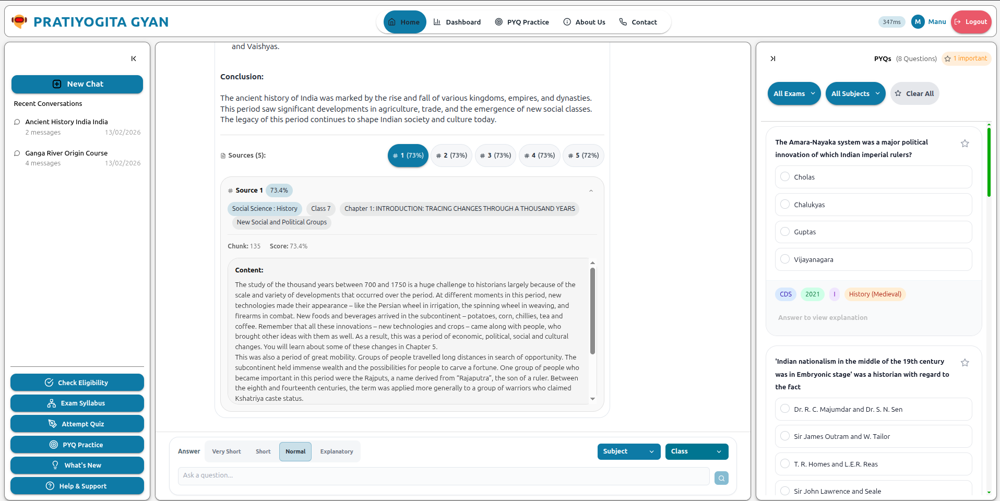
**Chat History** — All conversations saved and organized for review.

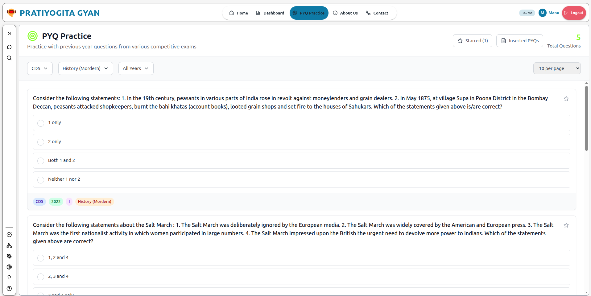
**PYQ Practice** — Thousands of real previous year questions with instant feedback.

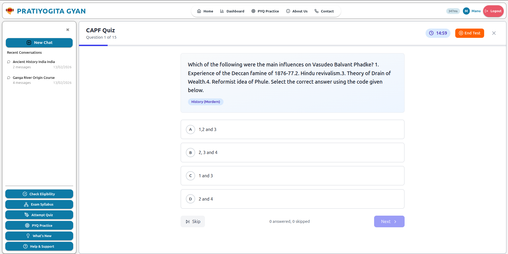
**Quiz Mode** — Timed quizzes with detailed scoring and explanations.

---

### Mobile Experience

<div align="center">
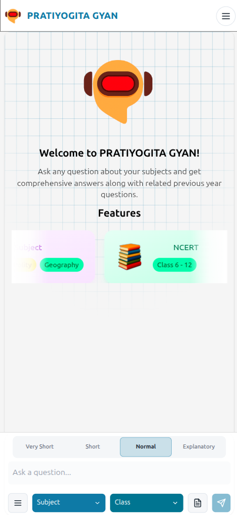
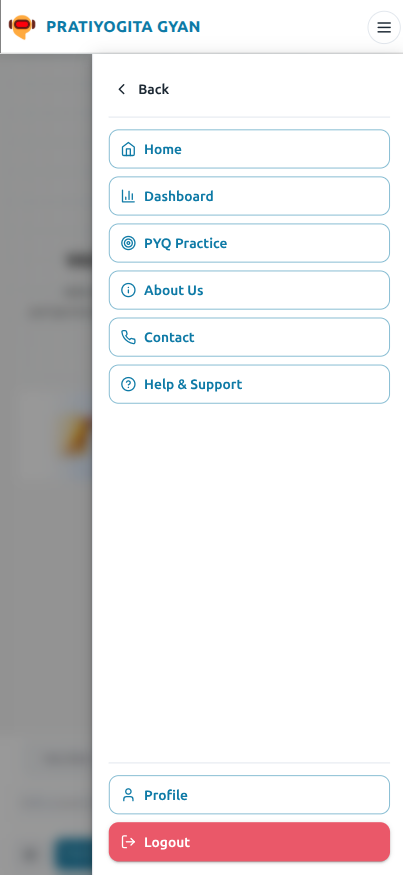
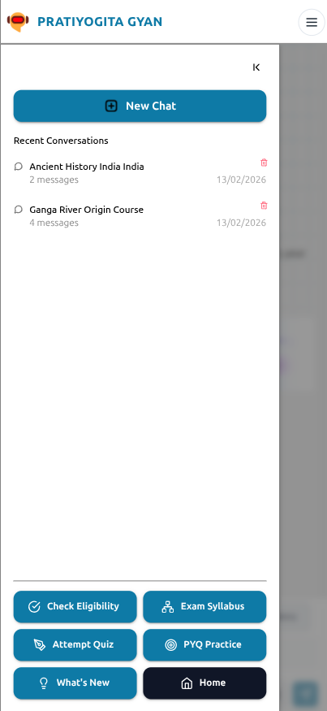
</div>

<div align="center">
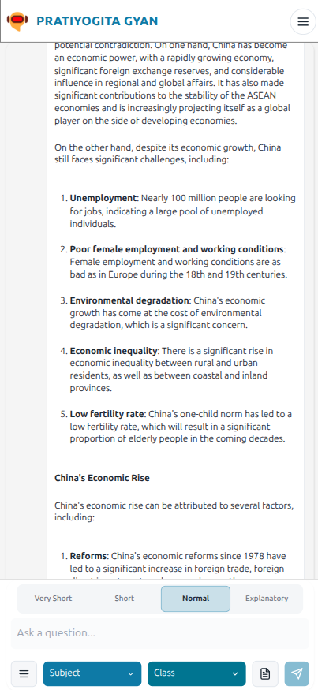
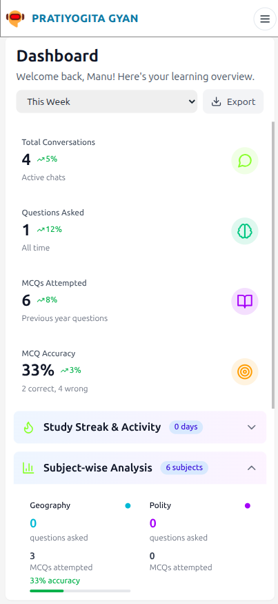
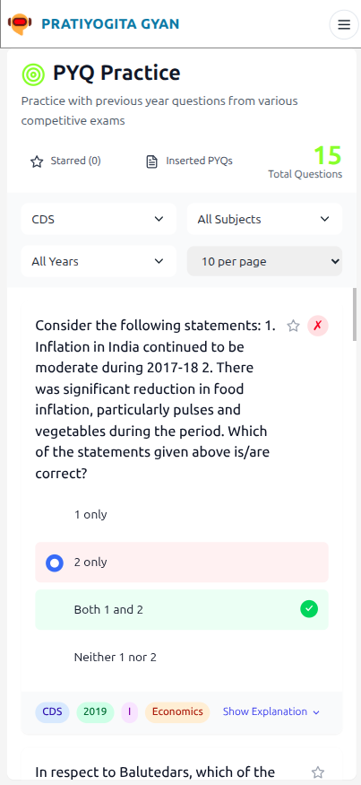
</div>

---

## Deployment

All frontends deploy to **Vercel** with SPA rewrite rules. The backend deploys to **Railway**, **Render**, or **Heroku**.

| App | Platform | Build Command | Output |
|-----|----------|---------------|--------|
| Setu | Vercel | `npm run build` | `dist/` |
| Yogya | Vercel | `npm run build` | `dist/` |
| Marg | Vercel | `npm run build` | `dist/` |
| Gyan Frontend | Vercel | `npm run build` | `dist/` |
| Gyan Backend | Railway/Render | `gunicorn app:app` | — |

Each frontend has a `vercel.json` with `"rewrites": [{ "source": "/(.*)", "destination": "/index.html" }]` for SPA routing.

Set all `VITE_*` environment variables in the Vercel dashboard under **Settings → Environment Variables**.

For the backend, set `PINECONE_API_KEY`, `OPENAI_API_KEY`, `GROQ_API_KEY`, and `ALLOWED_ORIGINS` in the hosting platform's config vars.

---

## Coming Soon

- **Voice Search** — Ask questions via voice in Pratiyogita Gyan
- **Regional Languages** — Hindi, Tamil, Telugu, and more across all apps
- **Native Mobile Apps** — Dedicated Android and iOS apps
- **Collaborative Mind Maps** — Real-time collaborative editing in Marg
- **Mock Tests** — Full-length mock exams with detailed analysis
- **AI Study Plans** — Personalized study schedules based on weak areas

---

**Built with care as a complete career preparation ecosystem for Indian students.**

*Happy studying! May your preparation journey be smooth and your results be excellent.*

**MIT License** — See [LICENSE](LICENSE) for details. Educational use is especially encouraged.

**© 2026 Pratiyogita Setu. Made with dedication for Indian students.**

</div>
